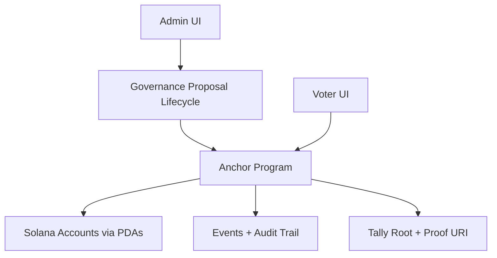

<h1 align="center">Chain Vote</h1>

<p align="center">
  
  
  
  
  
</p>

<p align="center">
  <strong>Governance-grade election protocol on Solana</strong><br>
  <i>Multisig-controlled lifecycle + private vote commits + auditable finalization</i>
</p>

---

## Why Chain Vote Exists

Digital voting systems often fail at one of these:
- voter privacy,
- governance transparency,
- tamper resistance.

Chain Vote is a practical MVP for civic and community elections where:
1. election administration is controlled via governance proposals,
2. voters commit privately, then reveal later,
3. final outcomes are anchored on-chain with proof metadata.

This aligns with open governance and janamat-style civic technology experiments.

---

## Problem → Solution

| Problem | Chain Vote Solution |
|---|---|
| Admin powers are opaque | Multisig proposal flow: create → approve → execute → consume |
| Votes can leak early | Commit-reveal design hides choices during voting phase |
| Phase abuse / replay risk | Strict forward-only phases + nonce-based replay protection |
| Weak auditability | On-chain events + published tally root + proof URI |

---

## What We Built

### Smart Contract (Anchor, Rust)
- Election state machine: `Created → Registration → Voting → Reveal → Finalized`
- PDA-based account model:
  - `Election`, `Candidate`, `VoterRecord`, `WhitelistEntry`
  - `AdminMultisig`, `GovernanceProposal`
- Governance action-hash verification for payload integrity
- Finalization guards:
  - final tally root must be set
  - all committed votes must be revealed

### Frontend (Next.js + TypeScript)
- Admin console for governance operations and election management
- Voter-facing election dashboard with tabs:
  - Vote, Reveal, Results, Candidates, Timeline
- Wallet integration, phase-aware UI, and user safety guards

### Security Highlights
- Commit/reveal duplicate prevention
- Governance nonce + consumed proposal replay protection
- Hash pre-checks on sensitive actions
- Chain-time checks for start/end correctness

---

## Architecture



---

## Product UX Summary

- **Admin flow** is explicit and safe: proposal nonce, status card, and action-specific forms.
- **Voter flow** is simple: select candidate → commit → reveal.
- **Clarity under errors**: human-readable errors for common cases (`StartTimeInPast`, `InvalidActionHash`, etc.).

---

## Repository Structure

- [programs/chain-vote](programs/chain-vote) — Anchor program
- [app](app) — Next.js frontend
- [tests](tests) — adversarial and lifecycle tests
- [scripts/reset-chain.sh](scripts/reset-chain.sh) — localnet reset helper

---

## Quick Start (Localnet)

### Prerequisites
- Rust (stable)
- Solana CLI
- Anchor CLI
- Node.js LTS

### Install

```bash
npm install
cd app && npm install
```

### Build

```bash
anchor build
```

### Reset local chain + deploy

```bash
./scripts/reset-chain.sh
```

### Run frontend

```bash
cd app
npm run dev
```

---

## Devnet Deployment (for bounty demo)

### 1) Switch cluster

```bash
solana config set --url https://api.devnet.solana.com
solana config get
```

### 2) Fund deployer

```bash
solana airdrop 2
solana balance
```

### 3) Deploy program

```bash
anchor build
anchor deploy --provider.cluster devnet
```

### 4) Configure frontend

Create/update [app/.env.local](app/.env.local):

```bash
NEXT_PUBLIC_RPC_URL=https://api.devnet.solana.com
NEXT_PUBLIC_WS_URL=wss://api.devnet.solana.com
NEXT_PUBLIC_PROGRAM_ID=<YOUR_DEVNET_PROGRAM_ID>
```

### 5) Start app

```bash
cd app
npm run dev
```

---

## Test Status

Run:

```bash
anchor test --skip-local-validator
```

Includes deterministic phase-machine and adversarial flow checks.

---

## Bounty Evaluation Mapping

| Evaluation Criteria | How Chain Vote Addresses It |
|---|---|
| Problem Statement | Trust-minimized, privacy-preserving elections |
| Potential Impact | Applicable to civic groups, DAOs, student/community governance |
| Business Case | Reusable election/governance primitive with extension opportunities |
| UX | Guided admin and voter flows with phase-aware feedback |
| Technical Implementation | Anchor PDAs, multisig governance, commit-reveal, adversarial tests |
| Demo Video | 3-minute flow can show end-to-end lifecycle |

---

## Submission Links (fill before final submit)

- **Live link:** `https://<your-live-link>`
- **Cluster:** `devnet`
- **Program ID (devnet):** `<YOUR_DEVNET_PROGRAM_ID>`
- **Demo video (≤ 3 min):** `https://<loom-or-youtube-link>`
- **Public build posts:**
  - X: `https://x.com/<handle>/status/<id>`
  - LinkedIn: `https://linkedin.com/posts/<id>`
- **Team:**
  - Name 1 — role
  - Name 2 — role
  - Name 3 — role (optional)
  - Name 4 — role (optional)

---

## Roadmap

- zk-friendly eligibility modules (`zkid`/`zkpassport` integrations)
- richer tally-proof verification
- indexer + analytics dashboard for election transparency
- mobile-first voter onboarding

---

## License

MIT
